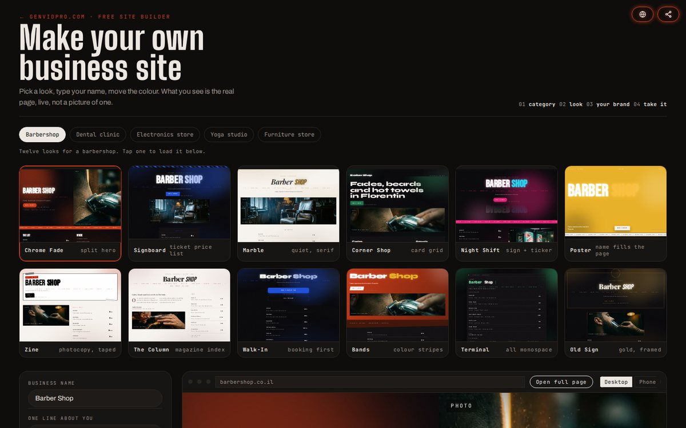
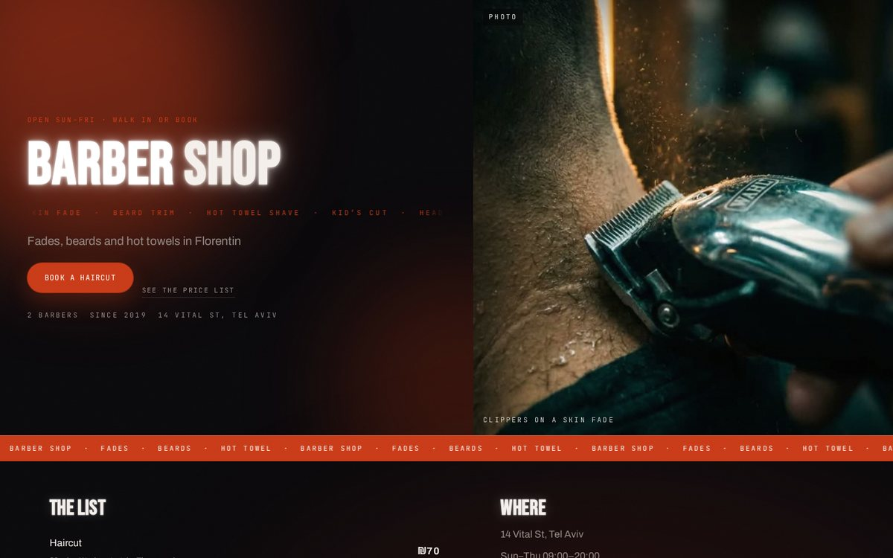
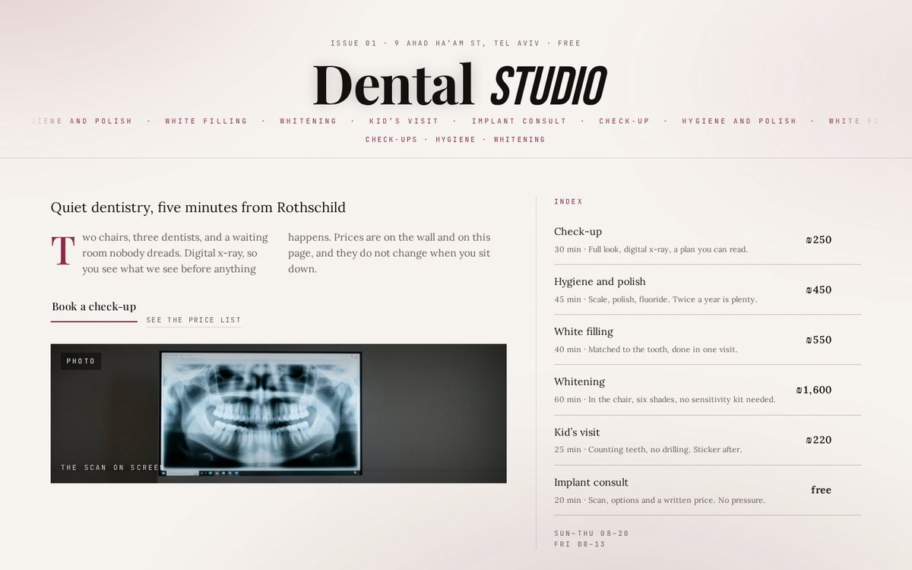
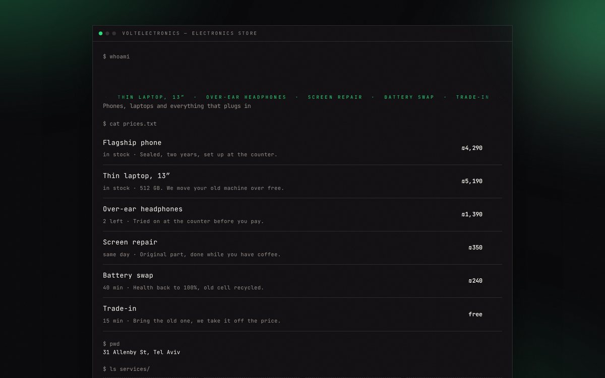
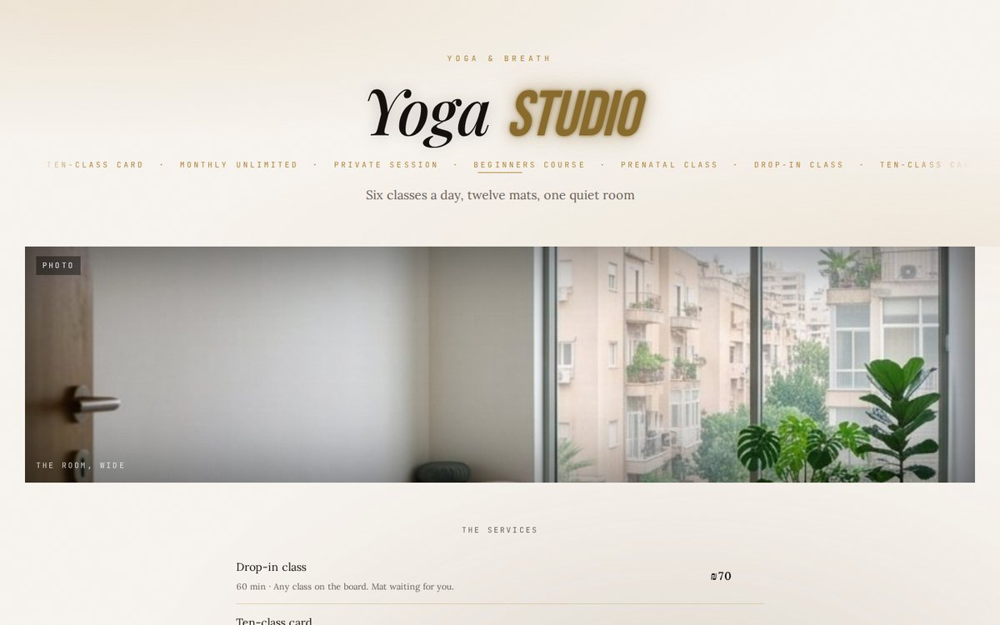
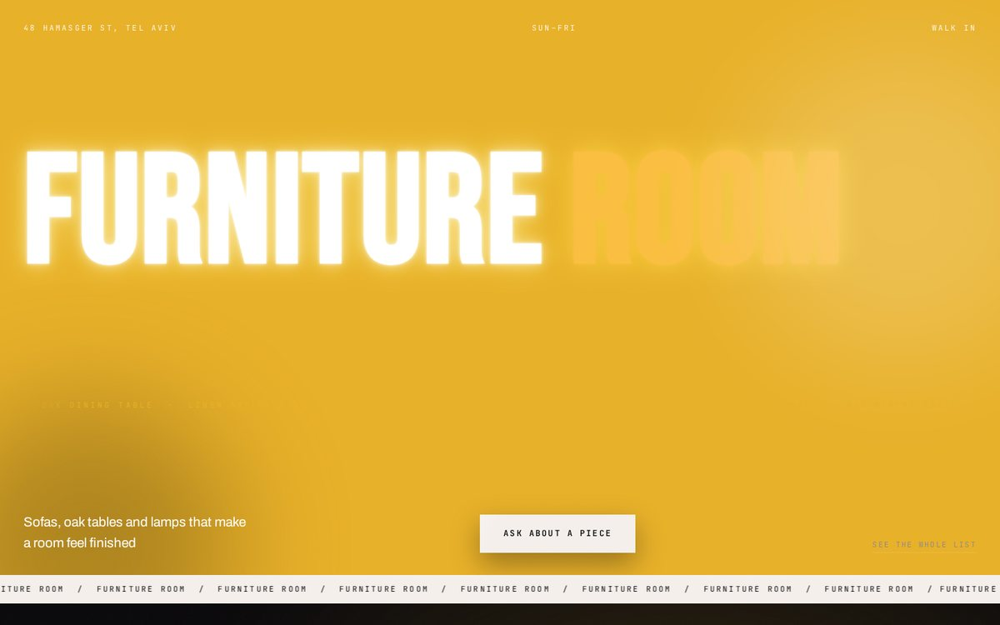
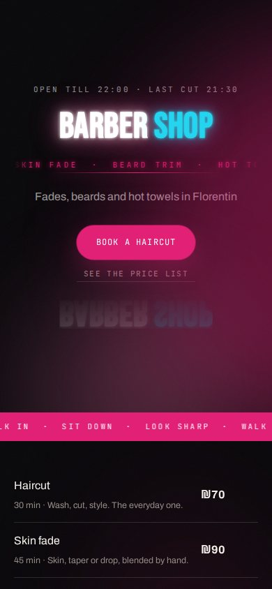
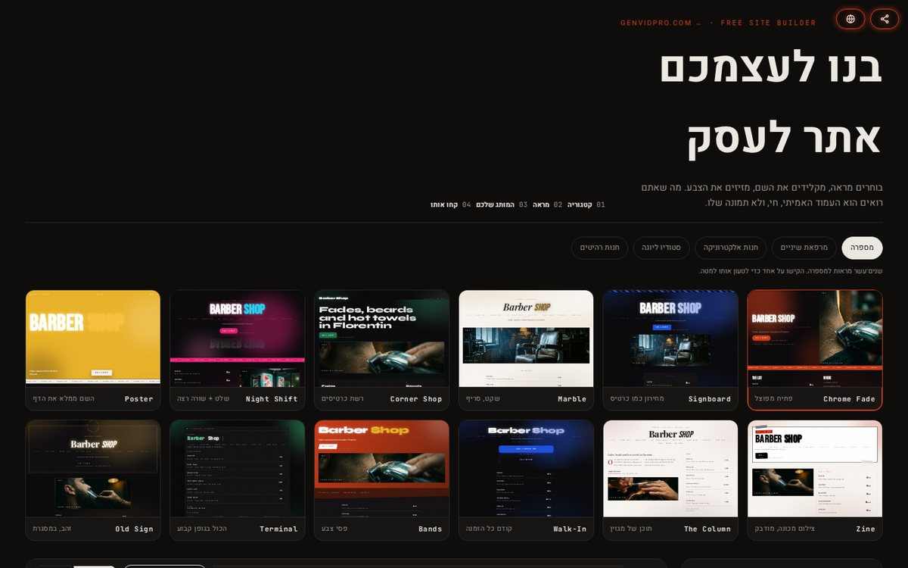
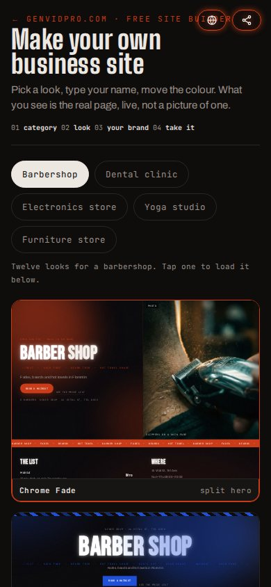

# Site Builder

A brief becomes a working one page site in minutes, in the client's own colours.
Twelve looks, five trades, and the file is yours at the end.

**Live: [genvidpro.com/builder](https://genvidpro.com/builder)** — the same code as this repository.

## What it does

1. Pick the trade: barbershop, dental clinic, electronics store, yoga studio, furniture store.
   Each one brings its own price list, its own photographs, its own opening hours and its own
   button copy — not the same page with a different title.
2. Pick one of twelve looks. Every tile is the real page rendered small by the same engine,
   not a screenshot: what you see is what you get.
3. Type your name, your line, your street, your WhatsApp number. Move the colour.
4. Download the HTML. One self-contained file, no build step, no account, no email.

## Twelve looks, one engine

Every look carries its own typeface and its own pair of colours. These are five of them,
each loaded with a different trade:

| Chrome Fade · barbershop | The Column · dental clinic |
|---|---|
|  |  |

| Terminal · electronics | Marble · yoga studio |
|---|---|
|  |  |

| Poster · furniture | Night Shift, on a phone |
|---|---|
|  |  |

The other six are Signboard, Corner Shop, Zine, Walk-In, Bands and Old Sign.

## Three languages, and Hebrew means RTL

The interface speaks English, עברית and Русский. Hebrew turns the whole page round —
direction, the order of the tiles, the alignment of every translated block — and sets the
copy in Heebo, because a Hebrew line in a Latin display face drops to a system font and
takes the design with it.

| Hebrew, right to left | On a phone |
|---|---|
|  |  |

The page the visitor downloads is written in English. The translator covers the builder,
which is where the decisions are made; translating the generated copy is a different job
and is not pretended here.

## Design decisions

- **One file out.** A small business owner should be able to move their site without a
  developer. No node_modules, no framework runtime, no build step.
- **The tiles are the product.** Twelve identical dark-orange thumbnails used to make one
  site look like twelve. Each look now owns a typeface and a colour pair, and each tile is
  the real page, live, at one sixth the size.
- **The trade is not a label.** Picking "dental clinic" used to leave the barbershop's
  prices and photographs in place. Every trade now carries its own content end to end.
- **Copy that fits.** Length rules per block, so nothing overflows on a phone.

## Files

- `builder.html` — the builder: brief form, twelve live tiles, preview, export
- `tpl-engine.js` — 88 KB engine: the twelve looks, the five trades, colour and copy logic
- `i18n.js` — English / Hebrew / Russian, the direction switch and the globe
- `favicon.svg`

Photographs of the generated sites are served from `genvidpro.com` by absolute address, on
purpose: the visitor downloads one HTML file and opens it from disk, where a relative path
would resolve to nothing.

## How this is built

Every idea, product decision and creative direction here is mine. The code is written in
pair with Claude: I design, decide and review, the agent types and tests.

## Status

In production use for GenVidPro clients. Part of
[genvidpro-site](https://github.com/romachorny/genvidpro-site), published separately
because it stands on its own.
